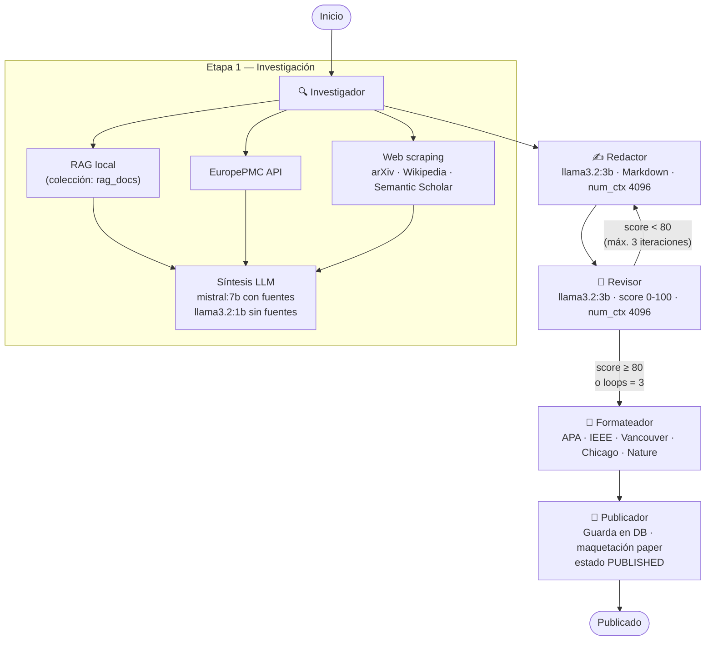

# Swarm Platform Builder — v0.2.0

Plataforma de construcción y orquestación de agentes IA construida sobre **FastAPI**, **LangGraph** y **Qdrant**. Permite crear proyectos independientes, cada uno con su propio swarm de agentes configurables, base documental RAG y flujo de trabajo personalizado.

El proyecto de referencia incluido es **AlejandrIA Magazine**: un pipeline de cinco agentes especializados para la investigación, redacción, revisión, formateo y publicación de artículos de revista científica, con soporte de re-ejecución parcial, cancelación en caliente y publicación directa por parte de administradores.

---

## Tabla de contenidos

1. [Stack tecnológico](#stack-tecnológico)
2. [Instalación local](#instalación-local)
3. [Cómo funciona la plataforma](#cómo-funciona-la-plataforma)
4. [Gestión de proyectos y agentes](#gestión-de-proyectos-y-agentes)
5. [Proyecto: AlejandrIA Magazine](#proyecto-alejandría-magazine)
   - [Flujo de redacción de papers](#flujo-de-redacción-de-papers)
   - [Roles y usuarios](#roles-y-usuarios)
   - [Asignar revisor a un artículo](#asignar-revisor-a-un-artículo)
6. [Customizar y crear agentes](#customizar-y-crear-agentes)
7. [Base documental RAG](#base-documental-rag)
8. [Referencia de API](#referencia-de-api)
9. [Configuración](#configuración)
10. [Estructura de carpetas](#estructura-de-carpetas)
11. [Desarrollo asistido por agentes (Claude Code)](#desarrollo-asistido-por-agentes-claude-code)
12. [Spec-Driven Development (SDD)](#spec-driven-development-sdd)

---

## Stack tecnológico

| Capa | Tecnología |
|---|---|
| Backend API | Python 3.12 · FastAPI · Uvicorn |
| Orquestación de agentes | LangGraph (`StateGraph`) |
| Base de datos | SQLite (dev) · PostgreSQL (prod) · SQLAlchemy async |
| Vector DB / RAG | Qdrant 1.18 |
| Embeddings | Ollama `nomic-embed-text` (768 dim) |
| LLM local | Ollama (`llama3.2:3b`, `llama3.2:1b`, `mistral:7b`, …) |
| LLM cloud (opcional) | OpenAI API / Azure / Groq / vLLM (compatible) |
| Frontend | React 18 · Vite · puerto 5173 |
| Auth | JWT HS256 · bcrypt 5.x |
| SSE | Server-Sent Events — streaming en tiempo real del pipeline |

---

## Instalación local

### Requisitos previos

- Python 3.12+
- Node.js 20+
- [Ollama](https://ollama.com/) instalado y ejecutándose
- [Qdrant](https://qdrant.tech/) binario o Docker

### 1. Clonar y preparar el backend

```bash
cd backend
python -m venv .venv

# Windows
.venv\Scripts\activate
# Linux / macOS
source .venv/bin/activate

pip install -r requirements.txt
```

### 2. Configurar variables de entorno

Copia el archivo de ejemplo y edítalo:

```bash
cp .env.example .env.local
```

Variables mínimas para desarrollo:

```env
DATABASE_URL=sqlite+aiosqlite:///./backend/data/dev.db
SECRET_KEY=<genera con: python -c "import secrets; print(secrets.token_hex(32))">
DEBUG=true
ENABLE_DEV_ROLE_PROMOTION=true

LLM_PROVIDER=ollama
OLLAMA_BASE_URL=http://localhost:11434
OLLAMA_MODEL=llama3.2
OLLAMA_EMBED_MODEL=nomic-embed-text

QDRANT_URL=http://localhost:6333
QDRANT_COLLECTION=rag_docs
RAG_VECTOR_SIZE=768
```

Para usar OpenAI en lugar de Ollama:

```env
LLM_PROVIDER=openai
OPENAI_API_KEY=sk-...
OPENAI_MODEL=gpt-4o-mini
# OPENAI_BASE_URL=   # dejar vacío para OpenAI; rellenar para Azure / Groq / vLLM
```

### 3. Descargar modelos Ollama

```bash
ollama pull nomic-embed-text   # embeddings (obligatorio para RAG)
ollama pull llama3.2:3b        # redactor / revisor (requiere ~2 GB RAM)
ollama pull llama3.2:1b        # formateador / publicador / síntesis paramétrica (~1 GB)
ollama pull mistral:7b         # investigador — síntesis con fuentes externas (~5 GB)
```

> Los modelos por agente se pueden cambiar desde la UI en **Agentes → configuración**. El modelo por defecto para todos los agentes es el definido en `OLLAMA_MODEL`.

### 4. Arrancar Qdrant

```bash
# Desde la raíz del proyecto (./storage se crea automáticamente aquí)
.\qdrant\qdrant.exe            # Windows
./qdrant/qdrant                # Linux / macOS
```

### 5. Arrancar el backend

```bash
cd backend
# Con las variables del .env.local exportadas manualmente, o usando dev-local.cmd
uvicorn app.main:app --reload --port 8000
```

### 6. Arrancar el frontend

```bash
cd frontend
npm install
npm run dev
```

### Arranque unificado (Windows)

Desde la raíz del proyecto, el script `dev-local.cmd` levanta Qdrant, el backend y el frontend en ventanas separadas:

```bat
dev-local.cmd
```

### Puertos por defecto

| Servicio | URL |
|---|---|
| Frontend | http://localhost:5173 (o 5174 si hay dos instancias Vite) |
| Backend API | http://localhost:8000 |
| Swagger UI | http://localhost:8000/docs |
| Qdrant Dashboard | http://localhost:6333/dashboard |
| Ollama | http://localhost:11434 |

### Arranque con Docker Compose

```bash
docker compose up --build
```

---

## Cómo funciona la plataforma

La plataforma organiza el trabajo en **proyectos**. Cada proyecto tiene:

- Un **tipo de caso de uso** (`alejandria_magazine`, `desarrollo`, `marketing`, `tiqueting`, `diseno`, `custom`)
- Un conjunto de **agentes** creados a partir de perfiles configurables (modelo LLM, temperatura, RAG, prompt template)
- Una **biblioteca documental** propia indexada en Qdrant para dotar a los agentes de contexto
- Un **diseñador de flujos visual** donde se conectan los agentes en el orden deseado

```
Plataforma
├── Proyecto A: AlejandrIA Magazine
│   ├── Agentes: investigador, redactor, revisor, formateador, publicador
│   └── Flujo: investigador → redactor → revisor → formateador → publicador
│
├── Proyecto B: Desarrollo de software
│   ├── Agentes: arquitecto, backend-dev, frontend-dev, qa-tester, code-reviewer
│   └── Flujo: arquitecto → backend-dev → qa-tester → code-reviewer
│
└── Proyecto C: Marketing
    ├── Agentes: estratega, copywriter, seo-specialist
    └── Flujo personalizado
```

### Ciclo de vida de una ejecución

1. El usuario crea un **artefacto** (artículo, ticket, tarea…) en su proyecto.
2. Selecciona una **secuencia de agentes** y lanza la ejecución.
3. El **Orchestrator** (LangGraph `StateGraph`) ejecuta cada nodo en el orden indicado.
4. Cada agente recibe el estado acumulado, lo enriquece y lo pasa al siguiente.
5. Los eventos se emiten en tiempo real vía **Server-Sent Events (SSE)**.
6. Al terminar, el artefacto se actualiza en la base de datos y queda disponible para revisión humana.

---

## Gestión de proyectos y agentes

### Crear un proyecto

Desde la interfaz, accede a **Proyectos → Nuevo proyecto**. Elige el tipo de caso de uso y asigna un nombre. Al crear el proyecto, se provisionen automáticamente los agentes predefinidos para ese tipo.

### Agregar agentes a un proyecto

Los agentes se gestionan en la sección **Agentes** del proyecto:

- **Agentes integrados** (`is_builtin = true`): preconfigurados por la plataforma. No pueden borrarse, pero sí editarse.
- **Agentes personalizados**: creados por el usuario desde la misma interfaz.

El nombre de un agente debe ser único dentro del proyecto y usar solo letras minúsculas, números, guiones y guiones bajos.

### Diseñar un flujo

En el **Flow Designer**, los agentes del proyecto aparecen como nodos arrastrables. Conecta los nodos en el orden que necesites. Los flujos se guardan y pueden reutilizarse en múltiples ejecuciones.

---

## Proyecto: AlejandrIA Magazine

AlejandrIA Magazine es el proyecto de referencia de la plataforma. Implementa un flujo editorial completo para la producción de artículos de revista científica mediante un swarm de cinco agentes especializados.

### Flujo de redacción de papers



#### Paso a paso

| Paso | Agente | Modelo por defecto | Qué hace |
|---|---|---|---|
| 1 | **Investigador** | `mistral:7b` (con fuentes) · `llama3.2:1b` (sin fuentes) | Busca en RAG (Qdrant) en su bucket **y en la biblioteca compartida** (`__library__`); los `rag_doc_ids` seleccionados tienen precedencia. Extrae **título y autores** de cada documento (metadatos PDF + heurística de primera página) para construir citas reales. También consulta EuropePMC y hace scraping web (arXiv / Wikipedia / Semantic Scholar) con re-ranking semántico (`nomic-embed-text`). Sintetiza con LLM (`timeout 600s`, `num_ctx 8192`). |
| 2 | **Redactor** | `llama3.2:3b` | Recibe el contexto de investigación y genera un borrador académico estructurado en Markdown (Abstract, Introducción, Metodología, Resultados y Discusión). Incorpora el feedback del Revisor en iteraciones sucesivas. `num_ctx 4096`, `keep_alive 0`. |
| 3 | **Revisor** | `llama3.2:3b` | Evalúa el borrador con score 0-100 y lista de comentarios. Si `score < 80` y `loop_count < 3`, reenvía al Redactor. `num_ctx 4096`, `keep_alive 0`. |
| 4 | **Formateador** | `llama3.2:1b` | Reformatea únicamente las citas y la sección de Referencias según el estilo solicitado: **APA**, **IEEE**, **Vancouver**, **Chicago** o **Nature**. Si el resultado es más corto que el 50 % del original, descarta y devuelve el texto original. `num_ctx 4096`, `keep_alive 0`. |
| 5 | **Publicador** | — (no usa LLM) | Escribe `formatted_text` (o `draft_text` si el formateador no se ejecutó) en la base de datos, cambia el estado a `PUBLISHED` y registra `published_at`. Además genera la **maquetación tipo paper** (HTML imprimible, una plantilla por formato de cita) y la guarda en `paper_html`, accesible en `GET /api/v1/articles/{id}/paper`. |

> **Gestión de memoria**: cada agente usa `keep_alive=0` para descargar el modelo de la RAM/VRAM al terminar, evitando conflictos de KV-cache entre agentes. `num_ctx` está fijado por agente para controlar el uso de RAM sin sacrificar calidad.

#### Bucle de revisión automática

```
Redactor ──► Revisor
    ▲            │ score < 80 y loops < 3
    └────────────┘
                 │ score ≥ 80 o loops = 3
                 ▼
           Formateador
```

El contador `loop_count` se incrementa solo cuando el Revisor rechaza. Al alcanzar 3 rechazos consecutivos, el flujo avanza igualmente para no bloquear el pipeline.

#### Ejecutar el pipeline

**Desde la UI:**

1. Crea un artículo (**Artículos → Nuevo artículo**) con título y palabras clave.
2. En el detalle del artículo, haz clic en **Reejecutar pipeline**.
3. Selecciona los agentes y el orden (todos preseleccionados por defecto).
4. Haz clic en **Lanzar**. Los eventos aparecen en tiempo real en el panel de ejecución.

**Desde la API:**

```bash
curl -X POST http://localhost:8000/api/v1/agents/{article_id}/run \
  -H "Authorization: Bearer <token>" \
  -H "Content-Type: application/json" \
  -d '{
    "flow_sequence": ["investigador", "redactor", "revisor", "formateador", "publicador"]
  }'
```

**Cancelar un pipeline en ejecución:**

```bash
curl -X DELETE http://localhost:8000/api/v1/agents/{article_id}/run \
  -H "Authorization: Bearer <token>"
```

El artículo queda en estado `DRAFT` con el contenido parcial generado hasta el momento.

**Seguimiento SSE en tiempo real:**

```
GET /api/v1/agents/{article_id}/stream
```

Eventos emitidos: `agent_start`, `log`, `agent_end`, `agent_error`, `done`, `done_error`, `cancelled`.

#### Flujos parciales soportados

```
# Solo redactar sin investigación previa:
redactor → revisor → formateador → publicador

# Solo revisar y reformatear un borrador existente:
revisor → formateador → publicador

# Publicar sin revisión (admin / redactor):
  → botón "Publicar borrador" en la UI (sin pipeline)
```

#### Estado del artículo

```
DRAFT ──► IN_REVIEW ──► PUBLISHED
                    ──► REJECTED ──► DRAFT
DRAFT ──────────────────────────► PUBLISHED  (publicación directa admin/redactor)
```

| Estado | Descripción |
|---|---|
| `draft` | Borrador, editable por el autor. El pipeline puede ejecutarse en cualquier momento. |
| `in_review` | Enviado a revisión humana (submit). No editable hasta resolución. |
| `published` | Aprobado y publicado. Visible en la revista pública. |
| `rejected` | Rechazado por el revisor humano. Vuelve a `draft` con comentario. |

#### Estado compartido entre agentes (`AgentState`)

El orquestador (LangGraph `StateGraph`) pasa un estado tipado entre nodos. Cada
ejecución de agente se registra además en la tabla `agent_runs` para trazabilidad.

```python
class AgentState(TypedDict):
    article_id: UUID
    author_id: UUID
    title: str
    keywords: list[str]
    research_data: str        # Contexto sintetizado por el Investigador
    sources: list[dict]       # Fuentes reales (title, authors, year, url, doi)
    draft_text: str           # Borrador del Redactor
    feedback: list[str]       # Comentarios del Revisor (se acumulan)
    approval_score: float     # Puntuación del Revisor (0-100)
    formatted_text: str       # Texto del Formateador (citas + referencias)
    scientific_format: str    # apa | ieee | vancouver | chicago | nature
    published_url: str
    metadata: dict            # Metadatos de publicación (word_count, licencia…)
    flow_sequence: list[str]  # Nodos a ejecutar
    current_step_index: int
    loop_count: int           # Iteraciones del bucle Revisor → Redactor
    agent_settings: dict      # Overrides por agente (modelo, formato, rag_doc_ids…)
    context_description: str  # Enfoque del autor (Investigador + Redactor)
    article_outline: str      # Estructura/esquema impuesto al Redactor
```

---

### Roles y usuarios

| Rol | Permisos clave |
|---|---|
| **admin** | Gestión completa: usuarios, proyectos, agentes, aprobar/rechazar/publicar artículos directamente |
| **redactor** | Crear y editar artículos, ejecutar pipelines, **publicar borradores directamente** sin pasar por revisión |
| **lector** | Solo lectura del proyecto asignado |
| **publico** | Acceso únicamente al endpoint público de la revista (sin autenticación) |

Al arrancar en modo desarrollo, se crean automáticamente los siguientes usuarios por defecto:

**Admin**:
- Email: `admin@admin`
- Contraseña: `admin123`

**Redactor de Pruebas**:
- Email: `redactor@example.com`
- Contraseña: `redactor123`

**Revisor Académico**:
- Email: `revisor@example.com`
- Contraseña: `revisor123`

> **Publicación directa**: los roles `admin` y `redactor` ven el botón **Publicar borrador** en el panel lateral del artículo. Este botón publica el artículo inmediatamente sin enviarlo a revisión humana.

---

### Asignar revisor a un artículo

El flujo de revisión humana complementa la revisión automática del agente Revisor:

1. El autor redacta el artículo y ejecuta el pipeline hasta que el texto le satisface.
2. El autor pulsa **Enviar a revisión** → el estado pasa a `in_review`.
3. El **admin** accede a **Artículos en revisión** y abre el artículo.
4. Desde el panel de administración, el admin puede:
   - **Aprobar** → el artículo pasa a `published` y aparece en la revista pública.
   - **Rechazar** → el artículo vuelve a `draft` con un comentario de revisión visible para el autor.
5. El autor recibe una **notificación** en la plataforma con el resultado.

> Solo el rol `admin` puede aprobar o rechazar artículos. El agente Revisor realiza una revisión automática de calidad del borrador, pero la decisión editorial final siempre recae en un administrador humano.

---

## Customizar y crear agentes

Cada agente es un **perfil** almacenado en la base de datos. Los campos configurables son:

| Campo | Tipo | Descripción |
|---|---|---|
| `name` / `slug` | string | Identificador único en el proyecto (ej: `mi-revisor`) |
| `model` | string | Modelo LLM a usar (ej: `llama3.2:1b`, `gpt-4o-mini`) |
| `temperature` | float 0-1 | Creatividad de las respuestas |
| `prompt_template` | texto | Instrucciones del sistema para el agente |
| `rag_enabled` | bool | Activa la búsqueda en la base documental |
| `rag_collection` | string | Colección Qdrant sobre la que busca |
| `rag_chunk_size` | int 100-4000 | Tamaño de fragmento al indexar documentos |
| `rag_chunk_overlap` | int 0-499 | Solapamiento entre fragmentos |
| `output_language` | string | Idioma de salida (ej: `spanish`, `english`) |
| `scientific_format` | enum | `apa` · `ieee` · `vancouver` · `none` |
| `target_word_count` | int | Extensión objetivo en palabras |

### Crear un agente nuevo desde la UI

1. Ve a **Agentes** dentro de tu proyecto.
2. Haz clic en **Nuevo agente**.
3. Rellena nombre (slug), descripción y elige el modelo LLM.
4. Guarda. El agente aparece disponible en el diseñador de flujos.

### Crear un agente desde la API

```bash
curl -X POST http://localhost:8000/api/v1/agents/claude-defs \
  -H "Authorization: Bearer <token>" \
  -H "Content-Type: application/json" \
  -d '{
    "project_id": "<uuid-del-proyecto>",
    "name": "mi-agente",
    "description": "Agente especializado en resúmenes ejecutivos",
    "model": "llama3.2:1b",
    "temperature": 0.5,
    "rag_enabled": true,
    "rag_collection": "rag_docs",
    "prompt_template": "Eres un experto en síntesis científica. Responde siempre en español.",
    "output_language": "spanish",
    "target_word_count": 800
  }'
```

### Editar un agente existente

```bash
curl -X PUT http://localhost:8000/api/v1/agents/claude-defs/<agent-uuid> \
  -H "Authorization: Bearer <token>" \
  -H "Content-Type: application/json" \
  -d '{
    "content": "{\"temperature\": 0.3, \"target_word_count\": 1200}"
  }'
```

> Los agentes integrados del sistema (investigador, redactor, revisor, etc.) no pueden borrarse, pero sí modificarse.

---

## Base documental RAG

La plataforma incluye una **biblioteca documental** por proyecto. Los agentes con `rag_enabled = true` buscan automáticamente en esta biblioteca cuando ejecutan.

### Subir documentos

Formatos admitidos: `.txt`, `.md`, `.pdf` (máx. 10 MB por archivo).

Desde la UI:
1. Accede a **Biblioteca** en el menú del proyecto.
2. Arrastra o selecciona el archivo y haz clic en **Subir**.
3. El documento se divide en fragmentos (chunks), se vectoriza con `nomic-embed-text` y se indexa en Qdrant.

Desde la API:

```bash
curl -X POST http://localhost:8000/api/v1/agents/rag/library/upload \
  -H "Authorization: Bearer <token>" \
  -F "file=@mi-paper.pdf" \
  -F "collection=rag_docs"
```

### Estructura interna

```
Qdrant
└── colección: rag_docs          # documentos generales del proyecto
    ├── punto UUID (chunk 1)
    │   ├── vector: [768 floats]   # nomic-embed-text
    │   └── payload: { doc_id, filename, agent_name, text }
    ├── punto UUID (chunk 2)
    └── ...
```

---

## Referencia de API

Documentación interactiva completa en **http://localhost:8000/docs**

### Autenticación
| Método | Ruta | Descripción |
|---|---|---|
| `POST` | `/api/v1/auth/register` | Registro de usuario |
| `POST` | `/api/v1/auth/login` | Login · devuelve JWT |
| `GET` | `/api/v1/auth/me` | Usuario autenticado actual |
| `GET` | `/api/v1/auth/users` | Listar usuarios (admin) |
| `PUT` | `/api/v1/auth/users/{id}/role` | Cambiar rol de usuario (admin) |
| `PUT` | `/api/v1/auth/users/{id}/project` | Asignar proyecto a usuario (admin) |

### Proyectos
| Método | Ruta | Descripción |
|---|---|---|
| `GET` | `/api/v1/projects` | Listar proyectos visibles al usuario |
| `POST` | `/api/v1/projects` | Crear proyecto |
| `GET` | `/api/v1/projects/{id}` | Detalle de proyecto |
| `DELETE` | `/api/v1/projects/{id}` | Eliminar proyecto (admin) |

### Artículos
| Método | Ruta | Descripción |
|---|---|---|
| `GET` | `/api/v1/articles` | Listar artículos |
| `POST` | `/api/v1/articles` | Crear borrador |
| `GET` | `/api/v1/articles/{id}` | Obtener artículo |
| `PUT` | `/api/v1/articles/{id}` | Actualizar artículo |
| `POST` | `/api/v1/articles/{id}/submit` | Enviar a revisión |
| `POST` | `/api/v1/articles/{id}/approve` | Aprobar (admin) |
| `POST` | `/api/v1/articles/{id}/reject` | Rechazar (admin) |
| `POST` | `/api/v1/articles/{id}/publish` | **Publicar directamente** (admin / redactor) |

### Agentes
| Método | Ruta | Descripción |
|---|---|---|
| `GET` | `/api/v1/agents/definitions` | Agentes integrados del sistema |
| `GET` | `/api/v1/agents/claude-defs?project_id=` | Perfiles de agentes del proyecto |
| `POST` | `/api/v1/agents/claude-defs` | Crear agente personalizado |
| `PUT` | `/api/v1/agents/claude-defs/{id}` | Editar agente |
| `DELETE` | `/api/v1/agents/claude-defs/{id}` | Eliminar agente (no integrados) |
| `GET` | `/api/v1/agents/models` | Modelos LLM disponibles en Ollama |
| `POST` | `/api/v1/agents/{article_id}/run` | Lanzar pipeline |
| `DELETE` | `/api/v1/agents/{article_id}/run` | **Cancelar pipeline en ejecución** |
| `GET` | `/api/v1/agents/{article_id}/runs` | Historial de ejecuciones |
| `GET` | `/api/v1/agents/{article_id}/stream` | Stream SSE en tiempo real |

### RAG / Biblioteca
| Método | Ruta | Descripción |
|---|---|---|
| `GET` | `/api/v1/agents/rag/library` | Listar documentos indexados |
| `POST` | `/api/v1/agents/rag/library/upload` | Subir documento |
| `DELETE` | `/api/v1/agents/rag/library/{collection}/{doc_id}` | Eliminar documento |
| `POST` | `/api/v1/agents/{agent}/rag/upload` | Subir documento a agente específico |

### Flujos
| Método | Ruta | Descripción |
|---|---|---|
| `GET` | `/api/v1/flows` | Listar flujos guardados |
| `POST` | `/api/v1/flows` | Guardar nuevo flujo |
| `PUT` | `/api/v1/flows/{id}` | Actualizar flujo |
| `DELETE` | `/api/v1/flows/{id}` | Eliminar flujo |

### Revista pública
| Método | Ruta | Descripción | Auth |
|---|---|---|---|
| `GET` | `/api/v1/magazine` | Artículos publicados para el slideshow | No |

---

## Configuración

La plataforma carga la configuración con la siguiente prioridad (de mayor a menor):

1. **Variables de entorno**
2. **`config.yaml`** (en la raíz o en `backend/`)
3. **Defaults** en `backend/app/core/config.py`

### Variables principales

| Variable | Default | Descripción |
|---|---|---|
| `SECRET_KEY` | — | **Obligatorio en producción.** Clave para firmar JWT. Generar con `secrets.token_hex(32)` |
| `DATABASE_URL` | `postgresql+asyncpg://...,http://localhost:5174` | URL de base de datos |
| `DEBUG` | `false` | Modo debug (activa hot-reload y admin auto-create) |
| `ALLOWED_ORIGINS` | `http://localhost:5173` | Orígenes CORS permitidos (coma-separados) |
| `LLM_PROVIDER` | `ollama` | Proveedor LLM: `ollama` o `openai` |
| `OLLAMA_BASE_URL` | `http://localhost:11434` | URL de Ollama |
| `OLLAMA_MODEL` | `llama3.2` | Modelo LLM por defecto |
| `OLLAMA_EMBED_MODEL` | `nomic-embed-text` | Modelo de embeddings |
| `OPENAI_API_KEY` | — | API key de OpenAI (si `LLM_PROVIDER=openai`) |
| `OPENAI_MODEL` | `gpt-4o-mini` | Modelo OpenAI por defecto |
| `OPENAI_BASE_URL` | — | Override para Azure / Groq / vLLM |
| `QDRANT_URL` | `http://localhost:6333` | URL de Qdrant |
| `QDRANT_COLLECTION` | `rag_docs` | Colección vectorial RAG por defecto |
| `RAG_VECTOR_SIZE` | `768` | Dimensión del vector (768 para nomic-embed-text) |
| `ENABLE_DEV_ROLE_PROMOTION` | `false` | Permite auto-promoción de rol (solo dev) |
| `DEV_ADMIN_PASSWORD` | `admin123` | Contraseña del admin auto-creado (solo SQLite/dev) |

---

## Estructura de carpetas

```
.
├── dev-local.cmd               # Arranque unificado Windows (Qdrant + backend + frontend)
├── docker-compose.yml          # Stack completo con Docker
├── Dockerfile                  # Imagen del backend
│
├── backend/
│   ├── requirements.txt
│   ├── .env.example
│   └── app/
│       ├── main.py             # FastAPI app · lifespan · middlewares · routers
│       ├── models.py           # ORM SQLAlchemy + DTOs Pydantic (en un solo archivo)
│       ├── database.py         # Engine · get_session · init_db
│       │
│       ├── core/
│       │   ├── config.py       # Settings (config.yaml + env vars)
│       │   └── security.py     # JWT · bcrypt · verify_token
│       │
│       ├── shared/
│       │   ├── database.py     # AsyncSessionLocal (para agentes/tareas async)
│       │   ├── llm.py          # Dispatcher unificado Ollama / OpenAI
│       │   └── agents_seed.py  # Provisión automática de agentes por tipo de proyecto
│       │
│       ├── agents/             # Archivos .agent.md — definición de agentes integrados
│       │   ├── investigador.agent.md
│       │   ├── redactor.agent.md
│       │   ├── revisor.agent.md
│       │   ├── formateador.agent.md
│       │   ├── publicador.agent.md
│       │   └── orquestador.agent.md
│       │
│       ├── modules/
│       │   └── agents/
│       │       ├── application/
│       │       │   └── use_cases.py     # Orchestrator · StateGraph · SSE events
│       │       └── adapters/
│       │           └── rag.py           # Extracción · chunking · embeddings · Qdrant
│       │
│       └── routers/
│           ├── auth.py          # Registro · login · gestión de usuarios
│           ├── articles.py      # CRUD artículos · submit · approve · reject
│           ├── agents.py        # Pipeline · perfiles de agentes · RAG · SSE
│           ├── ai.py            # Asistencia IA · ingest · format
│           ├── flows.py         # Flujos visuales guardados
│           ├── projects.py      # Proyectos
│           ├── magazine.py      # Endpoint público sin auth
│           ├── notifications.py # Notificaciones de usuario
│           ├── checkpoints.py   # Checkpoints de ejecución
│           └── config.py        # Lectura/escritura de config.yaml (admin)
│
├── frontend/
│   ├── package.json
│   └── src/
│       ├── App.jsx
│       ├── pages/               # Una página por sección de la UI
│       ├── components/          # Componentes reutilizables
│       ├── api/                 # Clientes HTTP por dominio
│       ├── store/               # Estado global (Zustand / Context)
│       └── services/            # Lógica de negocio frontend
│
├── qdrant/                      # Binario de Qdrant
└── storage/                     # Datos persistentes de Qdrant (colecciones)
```

---

## Tests

```bash
cd backend
python -m pytest tests/ -v
```

Los tests cubren el ciclo completo de autenticación (registro → login → token) y el flujo de agentes con LangGraph.

---

## Desarrollo asistido por agentes (Claude Code)

Además de los agentes *de producto* (el pipeline editorial), el repositorio
incluye **agentes de desarrollo** en `.claude/` para trabajar el backlog de
hardening de forma asistida.

### Lógica del agente `task-runner`

[`.claude/agents/task-runner.md`](.claude/agents/task-runner.md) define un
subagente que resuelve **una tarea del backlog de extremo a extremo** a partir de
su número de issue de GitHub:

1. **Lee la tarea** con `gh issue view <N>` y extrae *Problema*, *Definition of
   Done* y *Dependencias* ("⛔ Bloqueada por: #X").
2. **Verifica dependencias**: si alguna está abierta, se detiene y avisa (no
   implementa tareas bloqueadas).
3. **Carga contexto**: localiza la spec/ADR referenciados y los archivos
   implicados.
4. **Implementa** en una rama `sec/…`/`feat/…` (nunca en `develop`).
5. **Verifica** (`pytest`, `npm run build`) como parte del DoD.
6. **Reporta** el cumplimiento de cada punto del DoD. No hace `git push` ni cierra
   issues salvo que se le pida.

El backlog y los issues se generan con los scripts de
[`scripts/`](scripts/) (ver [SDD](#spec-driven-development-sdd)).

### Usar agentes desde la terminal

```bash
# Resolver una tarea por su número de issue
bash scripts/run-task.sh 119

# Resolver varias (1..N)
bash scripts/run-task.sh 119 120 121
```

El wrapper invoca `claude -p "/resolve-task <#issue> …"`. También puedes usarlo
dentro de una sesión interactiva de Claude Code:

```text
/resolve-task 119
```

El comando [`/resolve-task`](.claude/commands/resolve-task.md) lee cada issue y
delega en el subagente `task-runner`. Requisitos: la CLI `claude` instalada y
`gh` autenticado (con scope `repo`; y `project` si además gestionas el tablero).

---

## Spec-Driven Development (SDD)

El proyecto trabaja con **Spec-Driven Development**: la especificación va *antes*
que el código. Decisión y proceso en
[ADR-0002](docs/adr/0002-adopt-spec-driven-development.md).

### Flujo

```
Idea ─▶ Spec (docs/specs) ─▶ ADR si hay decisión arquitectónica
     ─▶ Épica + Tareas (GitHub Project) ─▶ Rama feat/… ─▶ PR contra develop
     ─▶ CI verde + revisión ─▶ Verificación de criterios de aceptación ─▶ Merge
```

### Documentación

| Documento | Contenido |
|-----------|-----------|
| [docs/specs/](docs/specs/) | Especificaciones + plantilla y ciclo de vida (Draft→Ready→Done). |
| [docs/adr/](docs/adr/) | Architecture Decision Records. |
| [docs/governance/GOVERNANCE.md](docs/governance/GOVERNANCE.md) | Roles, **Definition of Ready/Done**, política de revisión. |
| [CONTRIBUTING.md](CONTRIBUTING.md) | Flujo de contribución (SDD) y estándares. |
| [SECURITY.md](SECURITY.md) | Política y modelo de amenazas. |
| [docs/backlog/](docs/backlog/) | Épicas y tareas de hardening. |

### Backlog y GitHub Project

Las épicas y tareas se vuelcan al **GitHub Project** del repositorio (jerárquico:
campo `Epic`, sub-issues épica→tareas, DoD y dependencias):

```bash
# Crear el Project con todo el backlog (requiere gh con scope project)
python scripts/seed_github_project.py

# Eliminar el Project y sus issues (destructivo)
python scripts/delete_github_project.py --yes
```

Luego, en la UI del proyecto: **View ▸ Group by ▸ Epic**. Para implementar una
tarea, usa el agente: `bash scripts/run-task.sh <#issue>`.

---

## Licencia

Consulta el archivo [LICENSE](LICENSE) para más información.

