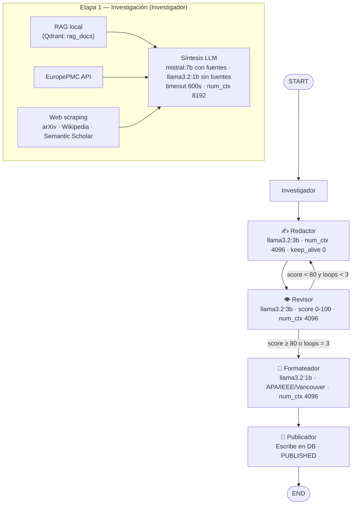

# Backend — AlejandrIA Magazine

Backend FastAPI con arquitectura modular, pipeline de agentes IA orquestado con **LangGraph**, RAG con **Qdrant** y modelos locales vía **Ollama**. Soporta cancelación en caliente de pipelines, streaming SSE en tiempo real y publicación directa por roles privilegiados.

---

## Estructura de carpetas

```
backend/
├── app/
│   ├── main.py                  # Entrada FastAPI, lifespan, routers, CORS
│   ├── database.py              # Engine SQLAlchemy, get_session, init_db
│   ├── models.py                # Modelos ORM (SQLAlchemy) + DTOs (Pydantic)
│   │
│   ├── core/
│   │   ├── config.py            # Settings (config.yaml + env vars)
│   │   └── security.py          # JWT HS256, bcrypt 5.x, hash_password, verify_token
│   │
│   ├── shared/
│   │   ├── database.py          # AsyncSessionLocal (para agentes/tareas async)
│   │   ├── llm.py               # Dispatcher unificado Ollama / OpenAI
│   │   │                        #   call_llm(prompt, model, timeout, keep_alive, num_ctx)
│   │   └── agents_seed.py       # Provisión automática de agentes por tipo de proyecto
│   │
│   ├── agents/                  # Definiciones .agent.md de agentes integrados
│   │   ├── investigador.agent.md
│   │   ├── redactor.agent.md
│   │   ├── revisor.agent.md
│   │   ├── formateador.agent.md
│   │   ├── publicador.agent.md
│   │   └── orquestador.agent.md
│   │
│   ├── modules/
│   │   └── agents/
│   │       ├── application/
│   │       │   └── use_cases.py     # Orchestrator · compile_graph · active_tasks · SSE
│   │       ├── adapters/
│   │       │   ├── investigador.py  # RAG local + EuropePMC + web scraping + síntesis
│   │       │   ├── redactor.py      # Borrador Markdown · feedback loop · RAG lookup
│   │       │   ├── revisor.py       # Score 0-100 · JSON structured output
│   │       │   ├── formateador.py   # APA · IEEE · Vancouver · Chicago · Nature
│   │       │   ├── publicador.py    # Escribe en DB · PUBLISHED · published_at
│   │       │   ├── generic.py       # Agentes personalizados desde .agent.md
│   │       │   └── rag.py           # Extracción · chunking · embeddings · Qdrant
│   │       └── domain/
│   │           └── entities.py      # AgentState (TypedDict)
│   │
│   └── routers/
│       ├── auth.py          # Registro · login · /me · gestión de usuarios y roles
│       ├── articles.py      # CRUD · submit · approve · reject · publish (directo)
│       ├── agents.py        # Pipeline · cancel · historial · perfiles · RAG · SSE
│       ├── ai.py            # Asistencia IA · ingest · format-body
│       ├── flows.py         # Flujos visuales guardados
│       ├── projects.py      # Proyectos · acceso de usuarios
│       ├── magazine.py      # Endpoint público sin auth
│       ├── notifications.py # Notificaciones de usuario
│       ├── checkpoints.py   # Checkpoints de ejecución
│       └── config.py        # Lectura/escritura de config.yaml (admin)
│
├── tests/
│   ├── test_auth_end_to_end.py      # Test E2E de autenticación
│   └── test_langgraph_agent_flow.py # Test del pipeline LangGraph
│
├── requirements.txt
├── Dockerfile
└── config.yaml
```

---

## Pipeline de agentes IA (LangGraph)

El pipeline se orquesta dinámicamente según la `flow_sequence` solicitada. El flujo estándar completo es:

```
START → Investigador → Redactor → Revisor → Formateador → Publicador → END
```

### Diagrama de flujo



### Descripción de cada agente

| Agente | Modelo por defecto | Responsabilidad |
|---|---|---|
| **Investigador** | `mistral:7b` / `llama3.2:1b` (fallback) | 3 etapas de búsqueda: RAG local (Qdrant), EuropePMC, scraping web (arXiv, Wikipedia, Semantic Scholar). Re-ranking semántico con `nomic-embed-text`. Síntesis con LLM (`timeout 600s`, `num_ctx 8192`). Cuando no hay fuentes externas usa `llama3.2:1b` para síntesis paramétrica. |
| **Redactor** | `llama3.2:3b` | Genera borrador académico en Markdown (Abstract, Introducción, Metodología, Resultados y Discusión). RAG lookup adicional con timeout de 25 s. Incorpora feedback del Revisor en iteraciones. `num_ctx 4096`, `keep_alive 0`. |
| **Revisor** | `llama3.2:3b` | Devuelve JSON `{approval_score, feedback[]}`. Si `approval_score < 80` y `loop_count < MAX_REVIEW_LOOPS (3)` → reenvía al Redactor. `num_ctx 4096`, `keep_alive 0`. |
| **Formateador** | `llama3.2:1b` | Reescribe únicamente las citas en el estilo solicitado (APA, IEEE, Vancouver, Chicago, Nature). Si el output es < 50 % del input en longitud, devuelve el original. `num_ctx 4096`, `keep_alive 0`. |
| **Publicador** | — | No usa LLM. Escribe `formatted_text` (o `draft_text`) en la tabla `articles`, cambia `status → PUBLISHED`, registra `published_at`. |

### Estado compartido entre agentes (`AgentState`)

```python
class AgentState(TypedDict):
    article_id: UUID
    author_id: UUID
    title: str
    keywords: list[str]
    research_data: str          # Contexto del Investigador
    sources: list[dict]         # Fuentes científicas encontradas
    draft_text: str             # Borrador generado por el Redactor
    feedback: list[str]         # Comentarios del Revisor
    approval_score: float       # Puntuación del Revisor (0-100)
    formatted_text: str         # Texto formateado por el Formateador
    scientific_format: str      # "apa" | "ieee" | "vancouver" | "chicago" | "nature"
    published_url: str          # URL final de publicación
    flow_sequence: list[str]    # Secuencia de nodos a ejecutar
    loop_count: int             # Iteraciones del bucle Revisor → Redactor
    current_step_index: int     # Índice del agente en ejecución (para SSE progress)
    agent_settings: dict        # Configuración por agente (model, temperature, …)
    context_description: str    # Contexto adicional del autor
```

### Cancelación de pipeline

El `Orchestrator` registra cada tarea en `active_tasks: Dict[UUID, asyncio.Task]`. El endpoint `DELETE /api/v1/agents/{article_id}/run` llama a `task.cancel()`, lo que inyecta `asyncio.CancelledError` en LangGraph. El manejador específico:

- Publica el evento SSE `{"type": "cancelled"}`.
- Deja el artículo en estado `DRAFT` con el contenido parcial.
- No registra error en la tabla `agent_runs`.

### Gestión de memoria (Ollama)

Cada llamada usa `keep_alive=0` (descarga el modelo al terminar) y `num_ctx` fijo por agente para evitar que el KV-cache ocupe toda la RAM disponible:

| Agente | `num_ctx` | RAM aprox. (llama3.2:3b) |
|---|---|---|
| Redactor | 4096 | ~2.6 GB |
| Revisor | 4096 | ~2.6 GB |
| Formateador | 4096 | ~1.5 GB (llama3.2:1b) |
| Investigador (síntesis) | 8192 | ~5.5 GB (mistral:7b con fuentes) |

Cada agente descarga su modelo antes de que el siguiente lo cargue, garantizando que nunca coexistan dos modelos grandes en RAM.

---

## Endpoints

| Agente | Responsabilidad |
|---|---|
| **Investigador** | Consulta Qdrant (RAG local) y APIs científicas públicas (EuropePMC, OpenAlex) para obtener contexto y fuentes reales |
| **Redactor** | Genera un borrador académico en Markdown usando Ollama (`llama3.2`), incorporando el contexto de investigación y el feedback previo del Revisor |
| **Revisor** | Evalúa el borrador con Ollama, devuelve una puntuación (0-100) y comentarios. Si `score < 80` y `loops < 3`, reenvía al Redactor |
| **Formateador** | Reformatea las citas y referencias según el estilo solicitado: **APA**, **IEEE** o **Vancouver** |
| **Publicador** | Escribe el texto final en la DB, cambia el estado del artículo a `PUBLISHED` y genera la URL de publicación |

### Estado compartido entre agentes (`AgentState`)

```python
class AgentState(TypedDict):
    article_id: UUID
    author_id: UUID
    title: str
    keywords: list[str]
    research_data: str       # Contexto del Investigador
    sources: list[dict]      # Fuentes científicas encontradas
    draft_text: str          # Borrador generado por el Redactor
    feedback: list[str]      # Comentarios del Revisor
    approval_score: float    # Puntuación del Revisor (0-100)
    formatted_text: str      # Texto formateado por el Formateador
    scientific_format: str   # "apa" | "ieee" | "vancouver"
    published_url: str       # URL final de publicación
    flow_sequence: list[str] # Secuencia de nodos a ejecutar
    loop_count: int          # Iteraciones del bucle Revisor → Redactor
```

Cada ejecución de agente se registra en la tabla `agent_runs` para trazabilidad completa.

---

## Endpoints

### Auth
| Método | Ruta | Descripción |
|---|---|---|
| `POST` | `/api/v1/auth/register` | Registro de nuevo usuario |
| `POST` | `/api/v1/auth/login` | Login, devuelve JWT |
| `GET` | `/api/v1/auth/me` | Datos del usuario autenticado |
| `GET` | `/api/v1/auth/users` | Listar usuarios (admin) |
| `PUT` | `/api/v1/auth/users/{id}/role` | Cambiar rol (admin) |
| `POST` | `/api/v1/auth/dev/promote-reviewer` | Auto-promoción a reviewer (solo `DEBUG=true`) |

### Articles
| Método | Ruta | Descripción |
|---|---|---|
| `GET` | `/api/v1/articles` | Listar artículos del autor / todos (admin) |
| `POST` | `/api/v1/articles` | Crear borrador |
| `GET` | `/api/v1/articles/{id}` | Obtener artículo por ID |
| `PUT` | `/api/v1/articles/{id}` | Actualizar artículo |
| `POST` | `/api/v1/articles/{id}/submit` | Enviar a revisión humana |
| `POST` | `/api/v1/articles/{id}/approve` | Aprobar (admin) |
| `POST` | `/api/v1/articles/{id}/reject` | Rechazar con comentario (admin) |
| `POST` | `/api/v1/articles/{id}/publish` | **Publicar directamente** (admin / redactor) |
| `POST` | `/api/v1/articles/{id}/assign-reviewer` | Asignar revisor por email o nombre |

### Agentes
| Método | Ruta | Descripción |
|---|---|---|
| `GET` | `/api/v1/agents/definitions` | Descripción de los 5 agentes integrados |
| `GET` | `/api/v1/agents/claude-defs?project_id=` | Perfiles de agentes del proyecto |
| `POST` | `/api/v1/agents/claude-defs` | Crear agente personalizado |
| `PUT` | `/api/v1/agents/claude-defs/{id}` | Editar agente |
| `DELETE` | `/api/v1/agents/claude-defs/{id}` | Eliminar agente (no integrado) |
| `GET` | `/api/v1/agents/models` | Modelos disponibles en Ollama |
| `POST` | `/api/v1/agents/{article_id}/run` | Lanzar pipeline |
| `DELETE` | `/api/v1/agents/{article_id}/run` | **Cancelar pipeline en ejecución** |
| `GET` | `/api/v1/agents/{article_id}/runs` | Historial de ejecuciones del artículo |
| `GET` | `/api/v1/agents/{article_id}/stream` | Stream SSE en tiempo real |

### RAG / Biblioteca
| Método | Ruta | Descripción |
|---|---|---|
| `GET` | `/api/v1/agents/rag/library` | Listar documentos indexados |
| `POST` | `/api/v1/agents/rag/library/upload` | Subir documento a biblioteca global |
| `DELETE` | `/api/v1/agents/rag/library/{collection}/{doc_id}` | Eliminar documento |
| `POST` | `/api/v1/agents/{agent}/rag/upload` | Subir documento a agente específico |

### Health
| Método | Ruta | Descripción |
|---|---|---|
| `GET` | `/health` | Estado del servicio |

---

## Ejecutar en local (sin Docker)

```bash
cd backend
python -m venv .venv
.venv\Scripts\activate        # Windows
# source .venv/bin/activate   # Linux / macOS
pip install -r requirements.txt

# Variables mínimas (Windows PowerShell)
$env:DATABASE_URL = "sqlite+aiosqlite:///./data/dev.db"
$env:SECRET_KEY   = "local-dev-secret"
$env:DEBUG        = "true"
$env:ENABLE_DEV_ROLE_PROMOTION = "true"

uvicorn app.main:app --reload --port 8000
```

Documentación interactiva disponible en: **http://localhost:8000/docs**

## Ejecutar con Docker Compose

Desde la raíz del proyecto:

```bash
docker compose up --build
```


---

## Configuración

El backend carga configuración desde `config.yaml` (raíz del repo). En Docker se monta en `/app/config.yaml`.

**Prioridad:**
1. Variables de entorno (`ENV`)
2. `config.yaml`
3. Defaults en `app/core/config.py`

### Variables principales

| Variable | Default | Descripción |
|---|---|---|
| `DATABASE_URL` | `postgresql+asyncpg://...` | URL de la base de datos |
| `SECRET_KEY` | `your-secret-key` | Clave para firmar JWT |
| `OLLAMA_BASE_URL` | `http://localhost:11434` | URL de Ollama |
| `OLLAMA_MODEL` | `llama3.2` | Modelo LLM a usar |
| `QDRANT_URL` | `http://localhost:6333` | URL de Qdrant |
| `QDRANT_COLLECTION` | `rag_docs` | Colección vectorial RAG |

---

## Tests

```bash
cd backend
python -m pytest tests/ -v
```

El test E2E de autenticación cubre: registro → obtener usuario autenticado → login → verificar nuevo token.

---

## Servicios del stack completo

| Servicio | URL |
|---|---|
| API FastAPI | http://localhost:8000 |
| Docs OpenAPI | http://localhost:8000/docs |
| Frontend | http://localhost:8080 |
| Ollama | http://localhost:11434 |
| Qdrant Dashboard | http://localhost:6333/dashboard |
